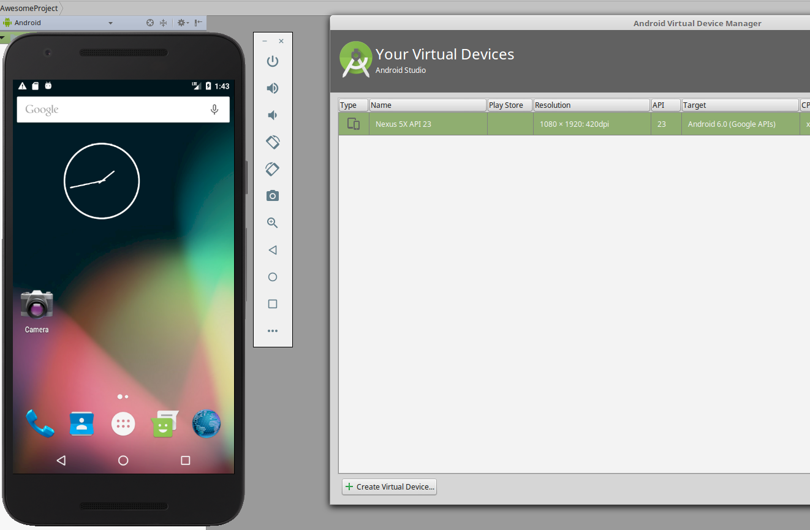
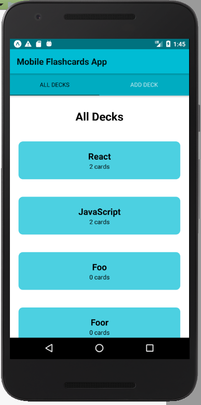
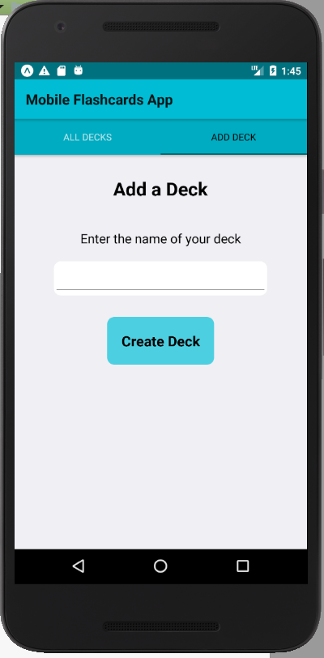
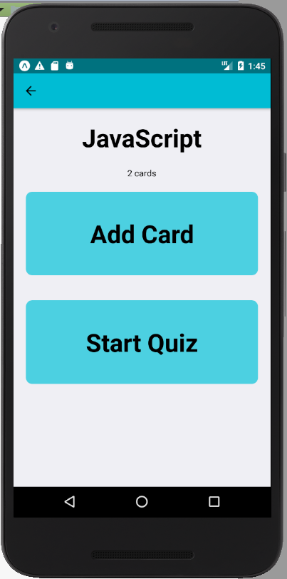
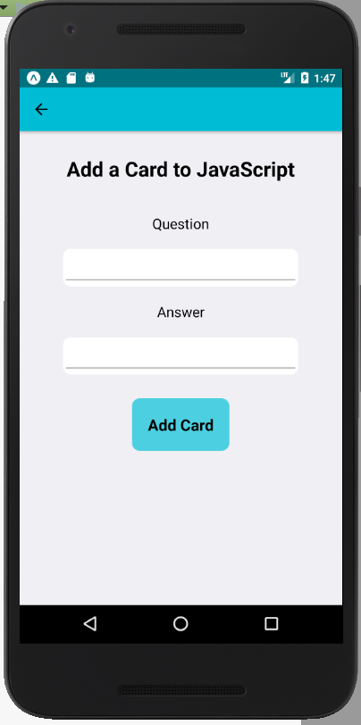
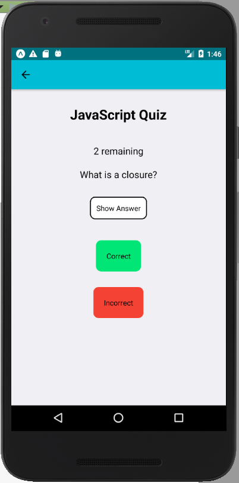
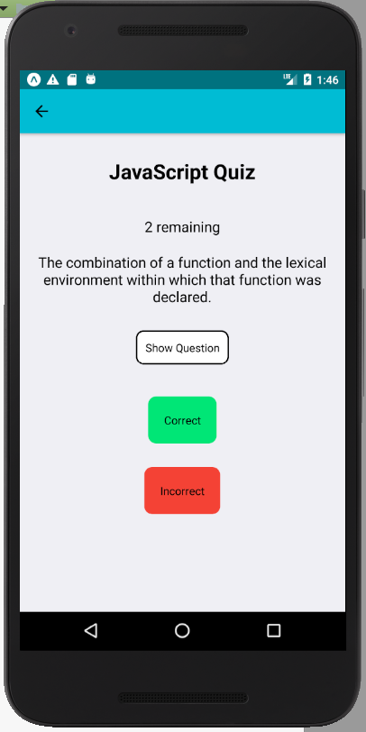
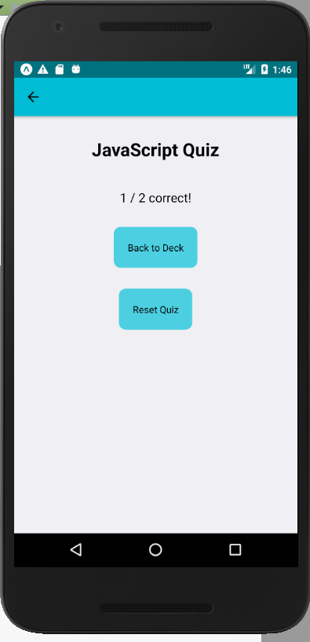

# Udacicards
Mobile flashcards app using React Native for final Udacity React Nanodegree project

### Usage

Open AVD in Android Studio and run a device.

In a terminal window, 

```
cd mobile-flashcards
yarn install
yarn start
```

When prompted, enter `a` to run the app in the Android Studio emulator.

This is an Android app that was tested on Android Studio with Expo. It has not been tested on an actual Android device. There are no Android-specific features in use, so it should work with iOS, but it has not been tested.

### Screenshots

I used Android Studio with Expo on Linux Mint 18.3 for development. 

















### Design Notes

The design used React Native with Redux. Navigation used a combination of TabNavigator and StackNavigator. The color scheme is partly taken from Google's Material Design documentation. 

The decks object is stored in [AsyncStorage](https://facebook.github.io/react-native/docs/asyncstorage.html) looking like this:

```
{
  React: {
    title: 'React',
    questions: [
      {
        question: 'What is React?',
        answer: 'A library for managing user interfaces'
      },
      {
        question: 'Where do you make Ajax requests in React?',
        answer: 'The componentDidMount lifecycle event'
      }
    ]
  },
  JavaScript: {
    title: 'JavaScript',
    questions: [
      {
        question: 'What is a closure?',
        answer: 'The combination of a function and the lexical environment within which that function was declared.'
      }
    ]
  }
}
```

The Redux store can only be updated with an action and reducer. The app has only one action to `GET_DECKS`, which reads from AsyncStorage and updates the store. Adding a new card or deck first pushes the new deck or card to AsyncStorage, then calls `GET_DECKS` to update the store from AsyncStorage.  

### Problems at scale

Android only supports about 6MB for AsyncStorage so eventually a prolific user might have too many decks. 

Having all the decks as a single object will be a problem when the object is huge. There's an option to only store the decks keys and then only grab one deck at a time from the API to local store. 

We could further restrict the number of cards pulled from AsyncStorage into the local store at once. 

### Further Development

- Consider using redux-persist
- Catch failures when accessing AsyncStorage
- Apply [Material-UI](http://www.material-ui.com/)
- Make another pass over the user interface. 
- Apply spaced repetition!
